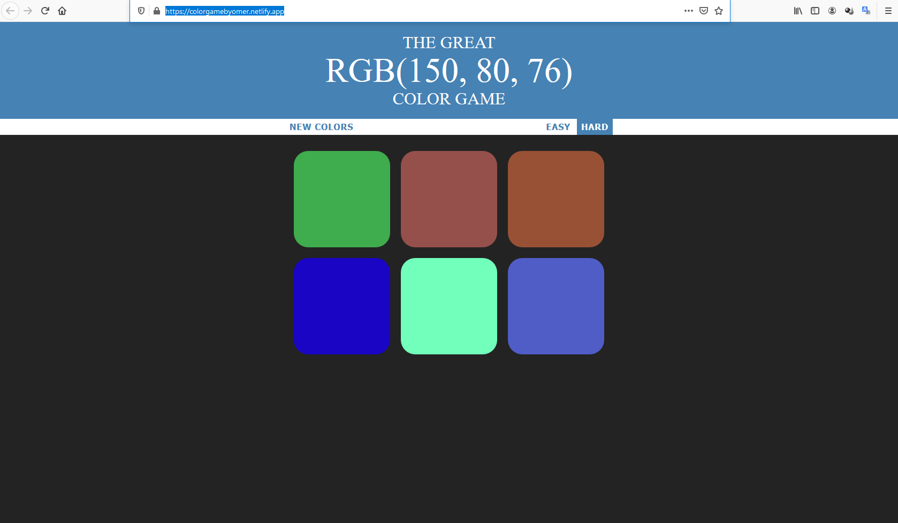
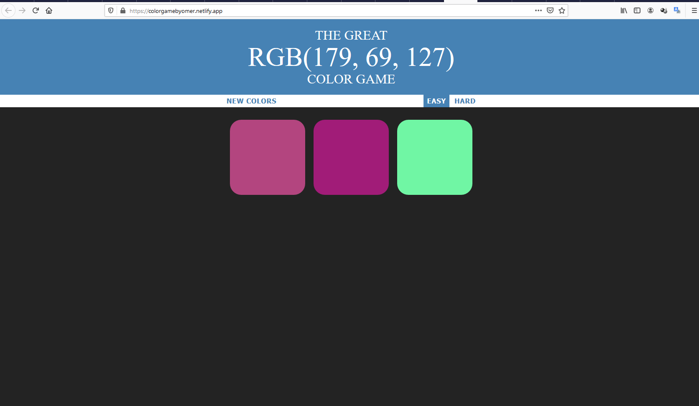
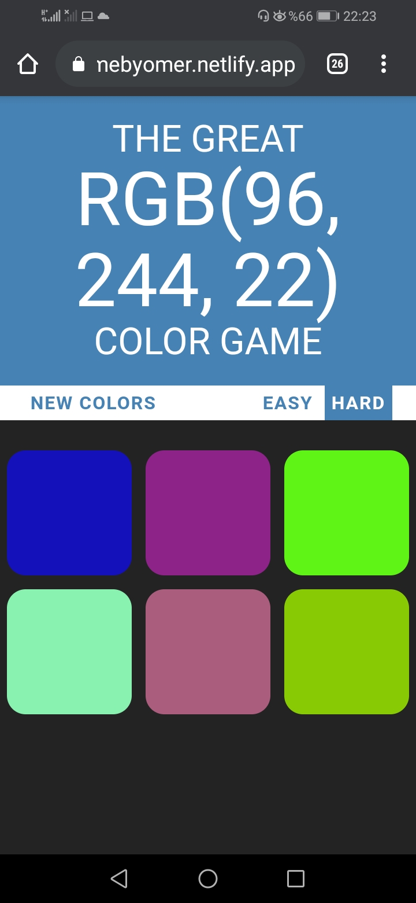
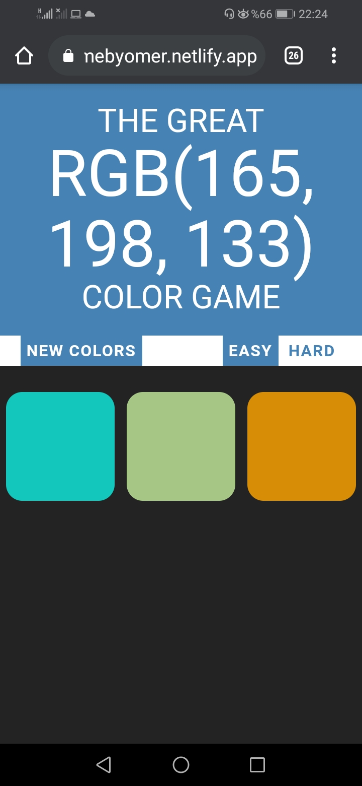

# Color-Game-JS

- Create a color game using DOM Manipulation of JavaScript.
- Working site : https://colorgamebyomer.netlify.app

## Table of contents

- [Table of contents](#table-of-contents)
- [General info](#general-info)
- [Technologies](#technologies)
- [Features](#features)
- [Screenshots](#screenshots)

## General info

- This project is built to improve Javascript DOM Manipulation and CSS skills.
- The [original web app](https://www.udemy.com/the-web-developer-bootcamp) was created by Colt Steele

## Technologies

- HTML
- CSS
- Javascript

# Clone this repository

\$ git clone https://github.com/DegirmenciOmer/Color-Game-JS.git

## Features

- Test your knowledge of RGB color codes.
- Look at the number above, and guess which square matches the RGB code.

(Hint: Remember the first number indicates the amount of RED, the second number indicates the amount of GREEN, and the third number indicates the amount of BLUE.)

## Screenshots

## On mobile :

